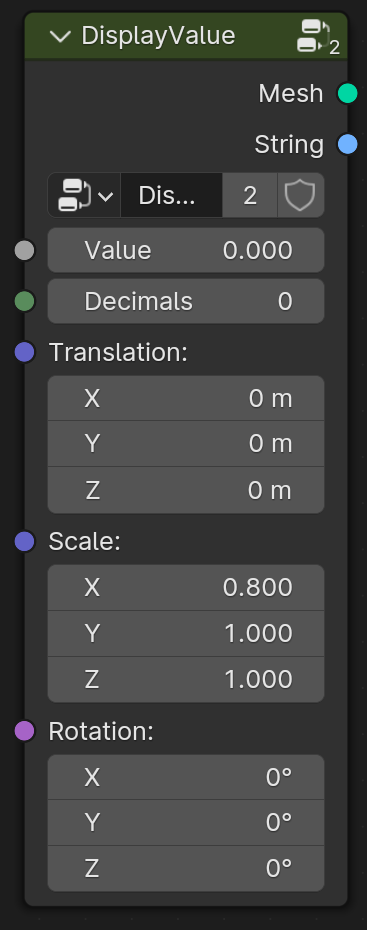
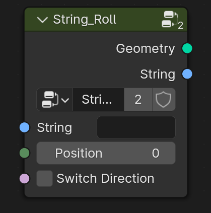
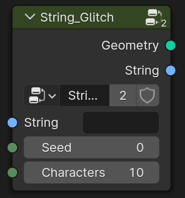
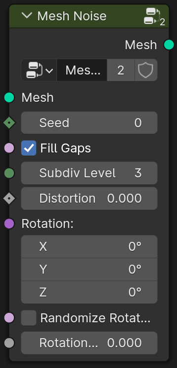
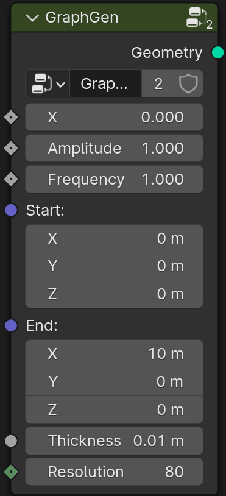

The Node Groups in the file are made for making it easier and shorter to perform common tasks while using Blender Geometry Nodes. 
The .blend file contains 8 separate node groups which can be appended to any file and used as the user requires. 
The nodes include: 
- Display_Value
- String_To_Mesh
- String_Roll
- String_Glitch
- Mesh_Noise
- Graph_Generator
- Distribute_Instances_On_Faces
- Mesh_Array

Date: 25/5/24  
Node groups made by Tejas Joshi

---

### How to install & use : 

1) In your current Blender Project, Go to : 
File ---> Append ---> Select the 'QuickNodes.blend' file ---> Select NodeTrees ---> Import all

2) In the Geometry Nodes panel under groups, all the new Node Groups will be visible.

---

The node groups are made entirely using the default available nodes included in Blender 4.1 & do not have any external components. The explanation of the nodes is written below.

### Node details :

### 1. Display Value 

The Display_Value Node Group is used for displaying values as strings or meshes.

**Inputs:**
1. **Value:** The Value (Float) is entered/connected here.
2. **Decimal:** The input here decides how many decimal points of the “Value” input will be displayed.
3. **Translation / Scale / Rotation:** These values are for manipulation of location, scale & rotation of the text.

**Outputs:**
1. **Mesh:** The mesh/geometry is outputted and can be connected to a “Join geometry” or directly displayed by connecting it to the output node.
2. **String:** The String data type is outputted if required by the user.

---

### 2. String_To_Mesh 

**Inputs:**
1. **String:** The string required to be converted to a mesh is inputted/connected here.
2. **Extrude:** Controls how much the face of the mesh will be extruded once printed.
3. **Outline (Boolean):** Determines if the output mesh will have an outline or not.
4. **Outline Thickness:** Determines the thickness of the outline (If Outline is true).
5. **Outline Material:** The material for the outline part of the mesh is to be connected/inputted here.
6. **Fill Material:** The material for the filled text mesh is to be entered/connected here.
7. **Translation/Rotation/Scale:** Manipulate the location, rotation & scale of the final mesh.

**Output:**
1. **Geometry:** The mesh of the string is outputted from here.

---

### 3. String_Roll 

The String_Roll Node Group is used to rotate a string one letter at a time in any direction.

**Inputs:**
1. **String:** The string needed to be rotated/rolled is inputted/connected here.
2. **Position:** The number of how many letters of the string to be rolled/rotated is entered/connected here.
3. **Switch Direction (Boolean):** This switch determines which direction the string will roll (Left to Right, or, Right to Left).

**Outputs:**
1. **Geometry:** A mesh/Geometry of the “Rolled” String is outputted.
2. **String:** A String data type is outputted.

---

### 4. String_Glitch 

The String_Glitch Node Group is used to cycle through random “Glitchy” Characters for the inputted string.

**Inputs:**
1. **String:** The string required to be manipulated is entered/connected here.
2. **Seed:** A random seed value for the “Glitchy” Characters.
3. **Characters:** The length of the inputted string required to be manipulated. (The max string size for the String_Glitch Node is 10)

**Outputs:**
1. **Geometry:** A mesh/Geometry of the “Glitchy” String is outputted.
2. **String:** A String data type is outputted.

---

### 5. Mesh_Noise 

The “Mesh_Noise” Node Group is used to add extrusions and make the mesh look noisy/Distorted.

**Inputs:**
1. **Mesh:** The base mesh to be distorted is inputted/connected here.
2. **Seed:** A random seed value for changing the randomizer of the extrusions.
3. **Fill Gaps (Boolean):** Toggle the fill of the gaps between the extruded parts of the mesh.
4. **Subdiv Level:** Determines the Subdivision level of the base mesh.
5. **Distortion:** Determines the Distortion of the output mesh.
6. **Rotation:** Determines the Rotation of the output mesh.
7. **Randomize Rotation (Boolean):** Randomizes the rotation of the distorted Output mesh.
8. **Rotation:** Random rotation value.

---

### 6. GraphGen 

This node is used for generating graphs from mathematical equations entered into the node. To enter an equation, open the node group and make your equation using math nodes and connect them to the labelled connections inside the group.

**Inputs:**
1. **X:** Input your X value for the graph. The base equation is: Y = (Components) * X
2. **Amplitude:** Controls the Amplitude of the graph.
3. **Frequency:** Controls the Frequency of the graph.
4. **Start:** Controls the location of where the graph should start from.
5. **End:** Controls the location of where the graph ends.
6. **Thickness:** Controls the thickness of the curve of the graph.
7. **Resolution:** Controls the amount of points the curve is divided into.

---

### 7. Distribute_Instances_On_Faces 

This node makes it possible to distribute instances directly on faces.

**Inputs:**
1. **Mesh:** Input the base mesh here. (The mesh you want to distribute instances onto)
2. **Instance:** Input the mesh you want to be distributed onto the base mesh here.
3. **Density:** Controls the density of the points on which the instances are distributed.
4. **Seed:** Controls the randomized seed of the distribution of the points.
5. **Instance Rotation:** Controls the rotation of each instance distributed on the faces.
6. **Instance Scale:** Controls the scale of all the distributed instances on the faces.

---

### 8. Mesh_Array 

This node makes it possible to create an array of geometry (Meshes) and access either individual or a range of meshes using indices.

**Inputs:**
1. **Multiple (Boolean):** If true, it will look at the min and max values and display all the meshes in range and distance them depending on the offset value.
2. **Index:** Index value of the geometry to be displayed.
3. **0 - 9:** Geometry inputs. The numbers correspond to the indices.
4. **Min:** Minimum value for the range.
5. **Max:** Maximum value for the range.
6. **Offset:** Controls the distance between meshes displayed.

---

